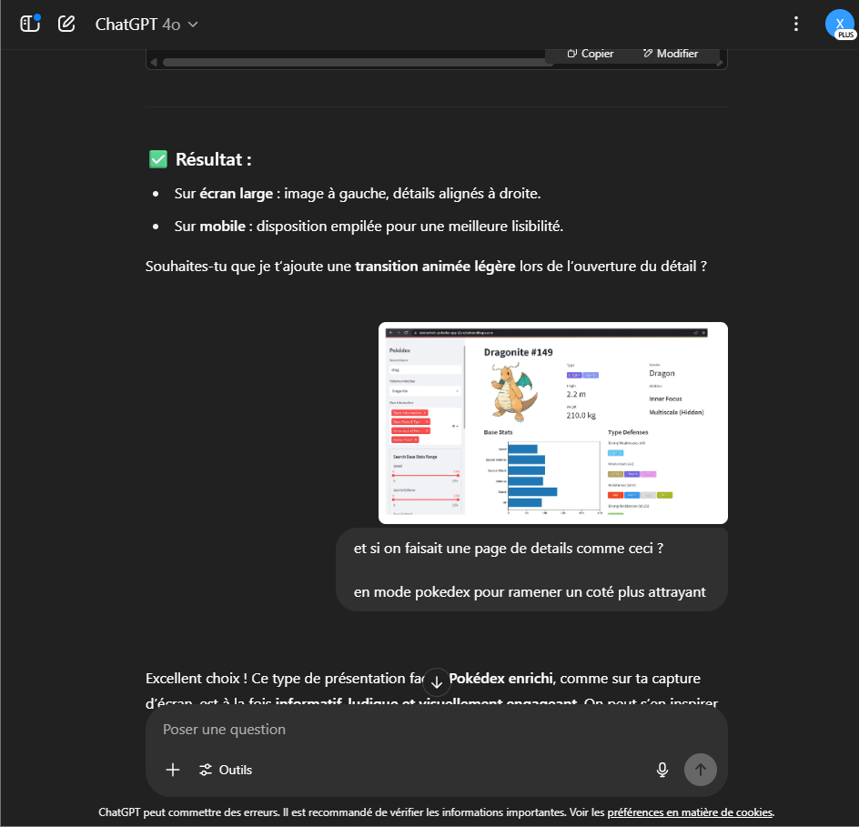

# PokéWeb project

Een moderne webapplicatie waarmee je Pokémon kunt ontdekken, filteren, bekijken en opslaan in je favorieten. De app is gebouwd met moderne JavaScript (ES6+), volledig als een Single Page Application (SPA), zonder backend en volledig gevoed door de PokéAPI.

---

## I. Projectbeschrijving en functionaliteiten

### I. Haalt automatisch 50 Pokémon op via de PokéAPI
- Haalt 50 Pokémon op via de PokéAPI.

### II. Toont elke Pokémon als kaart met afbeelding, naam en types
- Elke Pokémon wordt weergegeven als een kaart met afbeelding, naam en types.

### III. Detailpagina
- Je kunt op een kaart klikken om een gedetailleerde Pokédex-pagina te openen.

### IV. Moderne data-ophaling
- Gebruikt `async/await` voor API-aanroepen (zie `home.js` en `detail.js`).

### V. Favorieten
- Voeg Pokémon toe aan je favorieten, opgeslagen via `localStorage`.

### VI. SPA Navigatie
- Navigatie tussen de hoofdpagina en favorieten zonder herladen van de pagina.

### VII. Statistieken
- Geanimeerde voortgangsbalken tonen de basisstatistieken van de Pokémon.

### VIII. Type-badges
- Gekleurde type-badges (bijv. water = blauw, vuur = oranje, ...).

### IX. Zoekfunctie
- Dynamisch zoeken op naam.

### X. Sorteerfunctie
- Sorteren op naam, gewicht of lengte.

### XI. Filterfunctie
- Filteren op type via een dropdownmenu.

### XII. Responsive design
- Responsieve en nette interface (raster op desktop, kolommen op mobiel).

### XIII. Gestructureerde architectuur
- Overzichtelijke structuur in `src/` met gescheiden componenten (`router`, `pages`, `utils`...).

---

## II. Gebruikte API:

PokéAPI --> https://pokeapi.co/api/v2/pokemon?limit=50

---

## III. Technische vereisten + regelnummers

### A. Routing SPA (`src/routes.js`)
- Het bestand definieert statische routes (`/`, `/favorites`) en een dynamische route om de details van een Pokémon weer te geven (`/pokemon/:id`) (regel 3-6, 15-17).
- Bij een wijziging van de URL importeert de `handleRoute`-functie dynamisch het juiste module en roept de `render`-functie aan (regel 10-23).

### B. Pokémon-lijst (`src/pages/home.js`)
- Voor elke Pokémon wordt een detailaanvraag gedaan via de opgegeven URL (regel 9) en wordt elke kaart dynamisch in de DOM weergegeven via de functie `createPokemonCard` (regel 17).
- De lijst wordt opgeslagen in een globale variabele (`allPokemon`) voor sorteren en filteren (regel 18).

### C. Pokémon Details (`src/pages/details.js`)
- Wanneer een gebruiker een route bezoekt zoals `/pokemon/:id`, wordt deze pagina geladen.
- Er wordt een API-aanvraag gedaan om de gedetailleerde informatie van de Pokémon op te halen (regel 3), waarna een volledige interface wordt opgebouwd inclusief statistieken, types, lengte en gewicht, met geanimeerde voortgangsbalken (regel 5-37).

### D. Favorietenpagina (`src/pages/favorites.js`)
- Dit component haalt de favoriete Pokémon-ID's op uit `localStorage` (regel 7), doet de nodige API-aanvragen (regel 10), en gebruikt `createPokemonCard` om ze in een raster weer te geven (regel 11).
- Als er geen favorieten zijn opgeslagen, wordt er een informatief bericht weergegeven (regel 15-17).

### E. Pokémon Kaart (`src/utils/createCard.js`)
- Dit bestand bevat de logica om een DOM-component te maken die een Pokémon voorstelt (afbeelding, naam, types, favorietenknop).
- Het bevat de logica voor het beheren van favorieten via `localStorage` (regel 33-44) en maakt navigatie naar de detailpagina mogelijk door op de kaart te klikken (regel 46-48).

### F. Main
- Dit bestand beheert de gebruikersinteracties: zoekveld op naam, sorteermogelijkheden (op naam, lengte, gewicht), en filteren op type. Elke gebeurtenis verwerkt de `allPokemon` array en hergenereert de kaarten op het scherm.
- Bevat ook de logica om te wisselen tussen de hoofdweergave en favorietenweergave (regel 13-19).

---

## IV. Installatiehandleiding

```bash
git clone https://github.com/YanisDiouri/pokeweb.git
cd pokeweb
npm i 
npm run dev
```
    - open browser op http://localhost:3000

## V. Screenshots van de applicatie 

* Homepage  


* Favorites  
  

* Sort by Size 
  

* Sort by Weight  
  

* Filter by Type  
  

* Search  
  

* Detail Page
  

### VI. Gebruikte bronnen

PokéAPI --> https://pokeapi.co/api/v2/pokemon?limit=50

Cursus --> WebAdvancedEhbLes
ChatGPT
    
    
    
    
    
    
    
    
    
    


        
